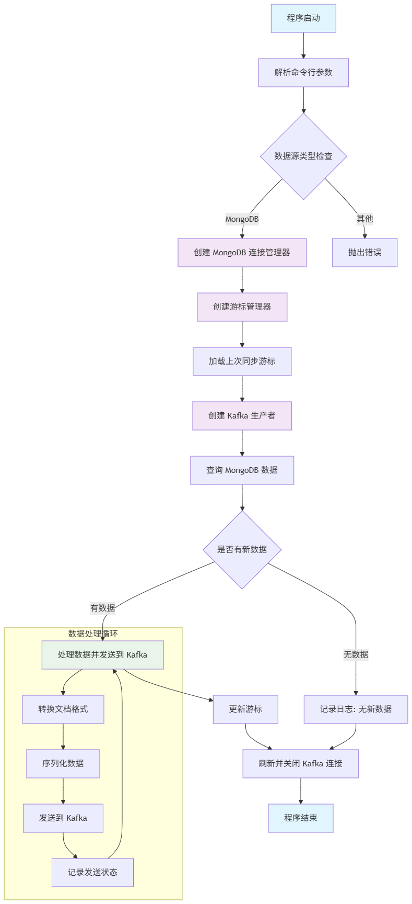

# Kafka Producer 数据同步项目

本项目是一个将多种数据源数据同步到 Kafka 的 Python 应用程序。它支持增量同步，能够从各种数据源中读取数据并将数据发送到指定的
Kafka 主题。目前支持 MongoDB 数据源，后续将扩展支持更多数据源。

## 项目概述

该项目主要用于将各种数据源中的数据实时同步到 Kafka
消息队列中，以便其他系统可以消费这些数据进行进一步处理。项目采用模块化设计，基于抽象基类构建，易于扩展和维护，可以方便地添加新的数据源支持。

## 功能特性

- **多数据源支持**：当前支持 MongoDB，易于扩展支持其他数据源
- **Kafka 数据发送**：将读取的数据发送到 Kafka 主题
- **增量同步**：支持基于特定字段的增量数据同步
- **连接池管理**：各种数据源和 Kafka 连接均采用连接池管理，提高性能
- **可扩展架构**：基于抽象基类的设计，易于扩展支持其他数据源
- **日志记录**：完善的日志记录机制，便于监控和调试
- **切面化处理**：使用装饰器实现日志记录和性能监控等横切关注点
- **依赖注入**：通过依赖注入提高代码的可测试性和解耦性
- **命令行接口**：通过命令行参数灵活配置同步任务

## 缺点

- **数据必须有增量字段**
- **无法对修改数据进行更新（除非将update_time做增量）**
- **无法对删除数据进行更新（除非将update_time做增量）**
- **数据暂时只做基础数据结构如json,字符串等，如datatime等类型需要单独处理（影响性能）**

## 项目结构

```
kafka_producer/
├── config.py                 # 配置文件，包含各种数据源和 Kafka 配置
├── main.py                   # 主程序入口
├── logger.py                 # 日志和状态管理模块
├── decorators.py             # 装饰器模块，处理横切关注点
├── README.md                 # 项目说明文档
├── models/
│   ├── __init__.py
│   └── mongodb_manager.py    # MongoDB 连接管理器（单例模式）
├── producers/
│   ├── __init__.py
│   ├── base_producer.py      # Kafka 生产者的抽象基类
│   └── mongodb_producer.py   # MongoDB 到 Kafka 的具体实现
└── cursor_model/
    └── base_cursor.py       # 游标基础模块，用于记录同步状态
    └── mongo_cursor.py       # mongodb游标模块
└── runtime/
    └── cursors/
        └── mongodb.cursors       # mongodb游标模块
```

## 核心组件

### 数据源管理器

- MongoDB 管理器：单例模式设计，使用连接池管理 MongoDB 连接
- 易于扩展支持其他数据源管理器（如 MySQL、PostgreSQL 等）

### Kafka 生产者基类 (BaseKafkaProducer)

- 抽象基类，定义了 Kafka 生产者的基本框架
- 提供统一的消息发送接口
- 支持消息转换和序列化功能
- 子类只需实现特定的抽象方法即可支持新的数据源

### 装饰器模块 (decorators.py)

- 提供日志记录和性能监控等横切关注点的处理
- 通过注解方式应用，降低业务代码的侵入性

### 游标管理 (logger.py)

- 抽象游标管理接口，支持多种游标存储方式
- 默认实现基于文件的游标管理

### 具体数据源实现

- MongoDB 到 Kafka 同步器：继承自 BaseKafkaProducer，实现 MongoDB 数据同步逻辑
- 易于扩展实现其他数据源到 Kafka 的同步器

## 配置说明

### MongoDB 配置

```python
MONGODB_DATABASES = {
    "default": {
        "type": "mongodb",
        'user': 'admin',
        'password': '',
        'auth_source': 'admin',
        'host': '',
        'port': 27017,
        'database': 'tlg',
        "charset": "utf8mb4"
    },
}
```

### Kafka 配置

```python
PRODUCER_CONFIG = {
    "bootstrap_servers": [],
    "compression_type": "gzip",
    "retries": 5,
    "acks": 1,
    "batch_size": 16384,
    "linger_ms": 1000,
}
```

## 使用方法

### 命令行方式（推荐）

使用命令行参数运行同步任务：

```bash
python main.py --data_source mongodb --topic temp3 --key my_hash --collection collection
```

参数说明：

- `--data_source`: 数据源类型（当前支持 mongodb）
- `--topic`: Kafka主题名称
- `--key`: 用于分区分类的键字段名
- `--collection`: MongoDB集合名称（仅mongodb数据源需要）

## 工作流程



## 工作原理

1. 从状态文件中读取上次同步的位置信息
2. 查询数据源中自上次同步以来的新数据
3. 将查询到的数据逐条发送到 Kafka 主题
4. 更新状态文件，记录本次同步的位置信息

## 扩展性

项目采用面向对象设计，易于扩展支持其他数据源：

### 添加新的数据源步骤：

1. 在 `models/` 目录下创建对应数据源的连接管理器
2. 在 `producers/`
   目录下创建继承自 [BaseKafkaProducer](file:///e:/python/kafka_prducer/producers/base_producer.py#L14-L57) 的具体实现类
3. 实现 [transform()](file:///e:/python/kafka_prducer/producers/base_producer.py#L53-L65)
   和 [value_serialize()](file:///e:/python/kafka_prducer/producers/base_producer.py#L67-L77) 抽象方法
4. 在 [main.py](file:///e:/python/kafka_prducer/main.py) 中添加相应的同步函数

### 切面化增强

项目通过装饰器实现了切面化处理：

- [@log_execution](file:///e:/python/kafka_prducer/decorators.py#L7-L22) - 自动记录方法执行日志
- [@monitor_performance](file:///e:/python/kafka_prducer/decorators.py#L25-L41) - 监控方法执行性能

### 未来计划

1. 支持更多数据源（MySQL、PostgreSQL等）
2. 实现更复杂的游标管理（如数据库存储）
3. 增加Web管理界面
4. 支持定时任务和实时同步模式
5. 增加更多的监控和告警功能
